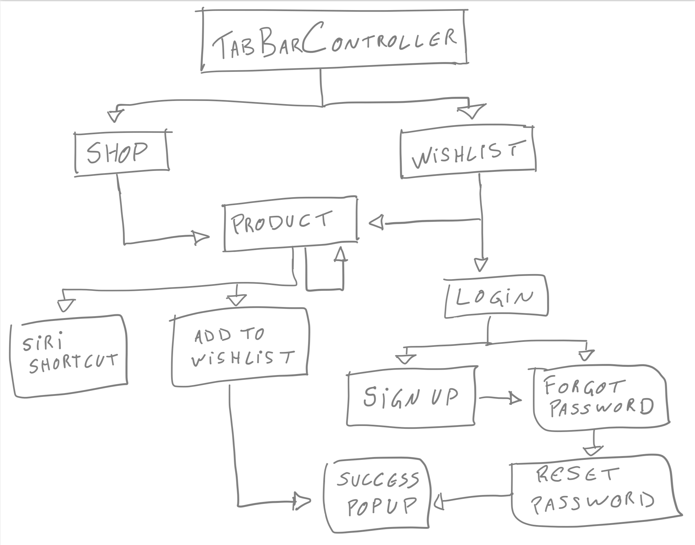

# Clean, Simple and Composable Routing for iOS Apps

This is the [second part](https://cassiuspacheco.com/applying-dependency-injection-to-composable-routing-for-ios-apps-ck7v10xaz01h9zis1oksoe7h0) of a series of blog posts about [Clean, Simple and Composable Routing for iOS Apps](https://hashnode.com/series/clean-simple-and-composable-routing-for-ios-apps-ck7vm42k401n4zis1wu4ar2od).

## App's Flow Diagram

## App's Flow Gif

## Deeplinking Example

