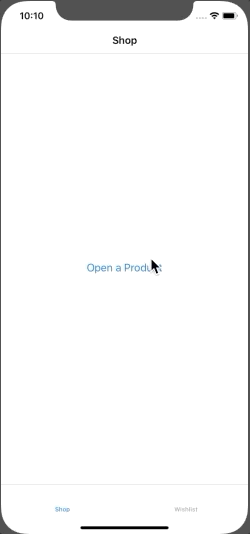

# Clean, Simple and Composable Routing for iOS Apps

This is the [third part](https://cassiuspacheco.com/unit-testing-composable-routing-in-swift-for-ios-apps-part-3-ck85u05av0018shs1vdc64t23) of a series of blog posts about [Clean, Simple and Composable Routing for iOS Apps](https://hashnode.com/series/clean-simple-and-composable-routing-for-ios-apps-ck7vm42k401n4zis1wu4ar2od).

## App's Flow Diagram

## App's Flow Gif

## Deeplinking Example

